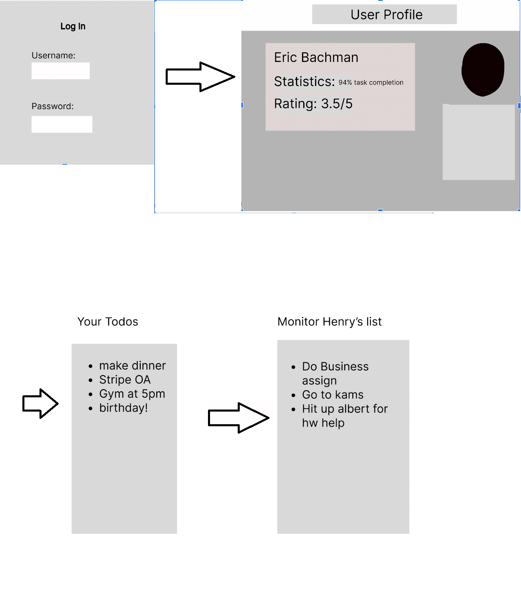

# Project Proposal

## In Check

## Project Summary

In Check is a web application that helps with creating checklists with the additional feature of making shared checklists where other people can keep you in check. There can be other users who can help you keep track of your progress and you can also view and copy other people’s tasks. One feature that we build upon this is sending reminders to people if they have not finished their tasks by their designated time.

There will be one table with all the users stored with attributes such as username, password, checklists, task completion rate, and other profile related information like gender, interests, etc. We will have a task table where you have attributes like the taskId, users, deadline (timestamp), creation time, duration, other users (friends)  looking over the task.

## Description
A lot of apps like Notion and other self productivity applications help with making to do lists but a lot of times people don’t actually do them because there is no one holding them accountable. Our App InCheck helps with keeping track of your progress on to-do lists and holds people accountable by letting their friends rate them and watch over their checklists/progress. The user can customize their tasks to their needs and also control who gets to keep them in check (i.e. friends). 

## Usefulness
Our project revolves around the fact that being productive is easier with peer accountability. By having tasks, deadlines, duration, and completion rate be in the public, there is more motivation for the individual to keep up. There are many productivity apps, but many are single user centric. There may be some social aspects to the app, such as group tasks or seeing other people’s tasks, but there aren't many that focus on peer accountability. 

Two examples of this are Notion and Strong. Notion is a personal productivity app with some social features, but it doesn’t have peer accountability. There is no way to view progress of tasks or keep in touch with other people’s productivity directly. Strong is a productivity app specifically for the gym with features such as a tracker for how many times the user goes to the gym. However, this app is only for working out. Our app combines these ideas to support generic tasks with other social components.

## Realness
The data will be all user generated. The profile table will be the users and their attributes: username, password, task completion rate, rating, etc. Some will be inputted directly by the user themselves (username, password), some will be from using the app (task completion rate), and some will be from other users (rating).
The tasks table will contain information about the tasks and their linked users. The most important attributes will be users, task ID, task content, deadline, creation time, duration, and friends. These are going to be generated as the user puts in their tasks. They will decide the task content, deadline, and friends that view the tasks. The other task metadata will be filled in by the app on creation.

For this project, this database will be initially filled with auto generated users and tasks. This will essentially act as a simulation of what the final product would look like.

## Functionality
When a user creates an account, we check if an account with that username already exists. If not, the account is created. The main functions of the app will be creating/ reading/ updating/ deleting tasks, creating friends, and searching other friends’ tasks and profiles. All the tasks are stored in a different table such that when the user views their tasks, it reads the todos from the database to display todos associated with your user and the tasks of your friends that you are listed as a “watcher” on.

## A low fidelity UI mockup

## Project work distribution
Our project work can be broken down into 3 main components - frontend, backend and database.
Our group will contribute in all 3 of these components. For each of the components, we can create a list of mini tasks such as creating the login page, sign up page, user database, UI  etc. which can be claimed by each of our group members respectively (similar to JIRA tickets).
We will have a page in the doc folder specifically for creating and assigning tasks. We are doing this so that everyone can get an equal experience in all aspects of front and backend without sacrificing clarity and equal work distribution.
